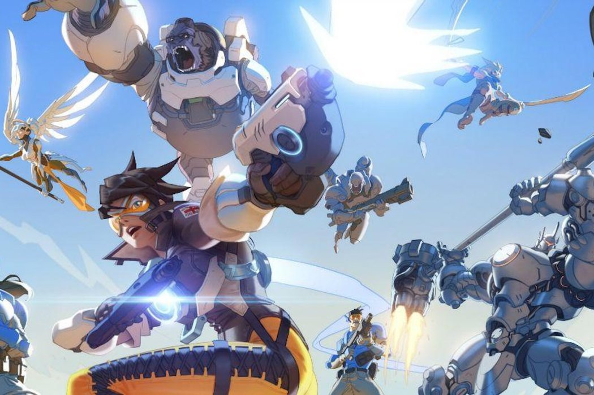

# Stat 420 Project

## Data Analysis: how to Increase your Overwatch Skill Rating

### Research Question

Overall we're interested in the question: if a player wants to improve their skill rating (SR), what should they focus on? Should they try to eliminate more opponents? Heal their teammates? Or, play a certain character? Answers like these will be provided by a predictive model of SR using career player statistics as predictors. The answers we find will allow any player to most efficiently improve their SR and begin climbing their way to Grandmaster!

The answers we find could be used by amateurs and pro Overwatch gamers alike. We think of our analysis as the start of something like ["Moneyball"](https://en.wikipedia.org/wiki/Moneyball) for Overwatch.

### Data

We scraped a snapshot of PS4 players' SR (it changes from game to game) whose profiles were public on overwatchtracker.com. We then scraped players' career statistics from the games that they've played from the open source API ovrstat.com which returns convenient JSON formatted data.

Currently we have over two thousand player skill ratings and over two thousand predictor variables. However, our research question will allow us to tailor our question to a small subset of the predictors, around 60 or so.

### Summary of findings

Our best model shows that if you want to climb the Overwatch skill leaderboard on Playstation 4, you should:

- Play Support heroes
- If you play a Tank, do a lot of damage to opponents, don't just stand there and protect your teammates. Go on the offensive!
- Play more games! This is obvious but important to remember. Sometimes you will feel you hit a skill wall and cannot improve. Our model however provides evidence that you should keep going! Play more and your `skill_rating` should improve.

The next step that could improve this analysis would be to track players' `skill_rating` over time and track what changes in variables lead to changes in `skill_rating`. However, for a first analysis of this data by anyone (to the best of our knowledge), we were able to get a good explanatory model of skill in Overwatch to help players focus their efforts and climb the rankings.

