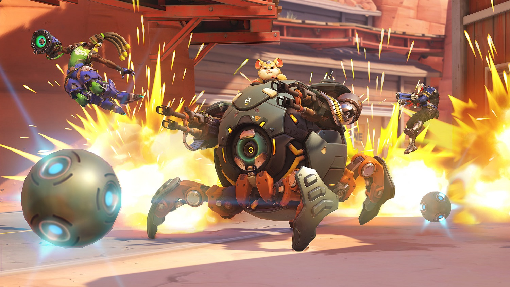

***

## Explaining the Overwatch Skill Rating

### Introduction
Our dataset consists of information on competitive gamers who play the video game Overwatch on Playstation 4. [Overwatch](https://en.wikipedia.org/wiki/Overwatch_(video_game)) is a team-based multiplayer first-person shooter developed and published by Blizzard Entertainment. Overwatch assigns players into two teams of six, with each player selecting from a roster of 30 characters, known as "heroes", each with a unique style of play whose roles are divided into three general categories that fit their role. Players on a team work together to secure and defend control points on a map or escort a payload across the map in a limited amount of time. 

Overwatch has a large community and E-Sports presence online. Players' skill in competitive games is calculated by a "secret" formula at Blizzard that leads to a "skill rating", or "SR" for short. SR ranges from 0 to 5,000, the higher the score the better the player.

Among the community, SR is divided into categories depending on how high the rating is, ranging from Bronze to Grandmaster:

- 500-1499 Bronze
- 1500-1999 Silver
- 2000-2499 Gold
- 2500-2999 Platinum
- 3000-3499 Diamond
- 3500-3999 Master
- 4000-5000 Grandmaster

##### Data

We scraped a snapshot of PS4 players' SR (it changes from game to game) whose profiles were public on overwatchtracker.com. We then scraped players' career statistics from the games that they've played from the open source API ovrstat.com which returns convenient JSON formatted data.

Currently we have over two thousand player skill ratings and over two thousand predictor variables. However, our research question will allow us to tailor our question to a small subset of the predictors, around 60 or so.

##### Research Question

Overall we're interested in the question: if a player wants to improve their SR, what should they focus on? Should they try to eliminate more opponents? Heal their teammates? Or, play a certain character? Answers like these will be provided by a predictive model of SR using career player statistics as predictors. The answers we find will allow any player to most efficiently improve their SR and begin climbing their way to Grandmaster!

The answers we find could be used by amateurs and pro Overwatch gamers alike. We think of our analysis as the start of something like ["Moneyball"](https://en.wikipedia.org/wiki/Moneyball) for Overwatch.

### Methods
```{r, echo=FALSE, message=FALSE}
library(tidyverse)
library(lmtest)
```

```{r, message=FALSE}
df = read_csv('data/clean-data.csv')
```

- relevel top hero - brian

```{r, echo=FALSE, message=FALSE}
df = df %>% 
  select(-c(game.gamesPlayed, game.timePlayed, rank)) %>% 
  mutate(top_hero = relevel(top_hero %>% as.factor(), ref='reinhardt'))
```


- glimpse - kai

```{r}
df %>% glimpse()
```

- summary - kai

```{r}
df %>% summary()
```


```{r, echo=FALSE, cache=TRUE}
mean_sr = mean(df$skill_rating)
sd_sr = sd(df$skill_rating)

hist(df$skill_rating,
     prob = TRUE,
     xlab   = "Skill Rating",
     main   = "Histogram of Skill Rating (Playstation 4 players)",
     breaks = 20,
     col    = "#56B4E9",
     border = "#999999")
curve(dnorm(x, mean = mean_sr, sd = sd_sr), 
      col = "#E69F00", add = TRUE, lwd = 3)
```

Above is a normalized (to sum to 1) histogram of the reponse we want to model `skill_rating`. It appears that `skill_rating` (blue bars) looks a lot like a normal distribution (the orange line). This is a good thing, as this makes it easier to adhere to the assumptions of linear regression model we will use to explain the variation in player skill.

- bar chart of top players - brian

##### Most played heroes

```{r, echo=FALSE, cache=TRUE}
df %>% group_by(top_hero_type, top_hero) %>% summarise(n = n()) %>% 
  ggplot(., aes(y=n, x=reorder(top_hero, n), fill=top_hero_type)) + 
  geom_bar(stat = "identity") +
  coord_flip() +
  theme_minimal() +
  labs(x='Hero', y='Number of players', title='Most popular heroes to play',
       fill = 'Hero type') +
  scale_fill_manual(values = c("#999999", "#E69F00", "#56B4E9"))
```

briefly mention hero types and what heros are: https://en.wikipedia.org/wiki/Characters_of_Overwatch#Characters

```{r}
# borrowed from week 8 HW
diagnostics <- function(model,
                        pcol = 'grey',
                        lcol = 'dodgerblue',
                        alpha = 0.05,
                        plotit = TRUE,
                        testit = TRUE
                        ){
  if (plotit){
    par(mfrow=c(1,2))
    # plot 1 - fitted vs resid
    plot(fitted(model), resid(model), col = pcol, pch = 20,
         xlab = "Fitted", ylab = "Residuals", main = "Residual versus fitted plot")
    abline(h = 0, col = lcol, lwd = 2)
    
    # plot 2
    qqnorm(resid(model), main = "Normal Q-Q Plot", col = pcol)
    qqline(resid(model), col = lcol, lwd = 2)
  }
  
  if (testit){
    st <- shapiro.test(resid(model))
    decision <- ifelse(st$p.value < 0.05, 'Reject', 'Fail to Reject')
    return(list(p_val=st$p.value, decision=decision))
  }
}
```


- full additive model without redundant variables - brian

```{r, cache=TRUE}
df %>% summary
fit_add_full = lm(skill_rating ~ . -top_hero_type, data = df)

diagnostics(fit_add_full, testit = FALSE)
```

- fail shapiro test, show qq plot - brian

```{r}
fm_diag = diagnostics(fit_add_full, plotit = FALSE)
 # TO DO WRITE OUT TEST RESUTS OF SHAPIRO WILK
fm_bp = bptest(fit_add_full)
 # TO DO WRITE OUT TEST RESUTS OF BP
fm_bp
```

##### Full additive model problems

There are two major problems in the full additive model: heteroskedasticity and non-normal residuals. We can try to find the correct model and apply transformations to the predictors. Or, what we'll do instead is think more carefully about the predictors and hand-pick a smaller model to start with based on exploratory data analysis and our knowledge of Overwatch.

- pairs plots response ~ 5 predictors - kai

```{r}
pair_vars = c("best.meleeFinalBlowsMostInGame",
              "best.offensiveAssistsMostInGame",
              "average.objectiveTimeAvgPer10Min",
              "average.allDamageDoneAvgPer10Min",
              "average.objectiveKillsAvgPer10Min",
              "games_played",
              "skill_rating")
pairs(df[pair_vars])
```

- correlation - brian

```{r}
find_cor_sr <- function(data){
  M <- cor(data %>% select_if(is.numeric))
  M[row.names(M) == 'skill_rating', !(colnames(M) %in% c('rank', 'skill_rating'))]
}

linear_cors = find_cor_sr(df)
sort(linear_cors, decreasing=TRUE) %>% head(5)
sort(linear_cors, decreasing=FALSE) %>% head(5)

cor(df$combat.meleeFinalBlows, df$best.meleeFinalBlowsMostInGame)

cor(df$average.allDamageDoneAvgPer10Min, df$average.barrierDamageDoneAvgPer10Min)
cor(df$average.allDamageDoneAvgPer10Min, df$best.offensiveAssistsMostInGame)
```

Explain `best.meleeFinalBlowsMostInGame` and why `combat.meleeFinalBlows` is redundant. wtih this.

Explain `average.allDamageDoneAvgPer10Min` and why it's more interpretable than `average.barrierDamageDoneAvgPer10Min` which is a result of your overall damage done per 10 minutes.

Explain `average.objectiveKillsAvgPer10Min` and why it's correlated with `average.objectiveTimeAvgPer10Min` but more actionable since it's more specific about what to do when a player is on the objective area.

And that's it. Those are the most correlated linear variables with SR we have.

- log(gp) - brian

##### Number of games played as a predictor

A player may need to get better to improve their "average" statistics laid out in the correlated variables above. But one thing *any* player can always do is play more. So we also want to consider the number of games played as a predictor of `skill_rating` as it's both actionable and an obvious variable to control for, i.e. are the most skilled just those who have played the most?

```{r}
cor(df$skill_rating, df$games_played)

par(mfrow=c(1,2))
plot(skill_rating ~ games_played, data = df)
plot(skill_rating ~ log(games_played), data = df)
```

We can see that the natural log transform of `games_played` makes the positive relationship with `skill_rating` easier to see and brings in the long tail of players who have played many more games than the median player. This will help prevent heteroskedasticity with this predictor in the linear model.

- step bic + aic - kai

```{r}
df_final = df %>% select(one_of(c(pair_vars, 'top_hero')))

fit = lm(skill_rating ~ top_hero : . + ., data = df_final)
summary(fit)
```

```{r include=FALSE}
# backward AIC
back_aic = step(fit, direction = "backward")
summary(back_aic)

# backward BIC
n = length(resid(fit))
back_bic = step(fit, direction = "backward", k = log(n))
summary(back_bic)
```


We wanted a smaller model for better explanatory power so we first tried a backwards search using BIC. However, the adjusted $R^2$ was lower than the model chosen using a backwards search using AIC.

- show r^2 - kai

```{r}
summary(back_aic)$adj.r.squared
summary(back_bic)$adj.r.squared
```

- 2 anova tests - kai

```{r}
# null model
fit_null = lm(skill_rating ~ 1, data = df)
# model chosen by backwards BIC
fit_full = lm(skill_rating ~ best.meleeFinalBlowsMostInGame + 
    best.offensiveAssistsMostInGame + average.allDamageDoneAvgPer10Min + 
    average.objectiveKillsAvgPer10Min + games_played, 
    data = df)
anova(fit_null, fit_full)
```

Here we reject the null hypothesis and confirm that the model chosen by using a backwards search using BIC is significant.

```{r}
# compare BIC with AIC 
# model chosen by backwards BIC
fit_null = lm(skill_rating ~ best.meleeFinalBlowsMostInGame + 
    best.offensiveAssistsMostInGame + average.allDamageDoneAvgPer10Min + 
    average.objectiveKillsAvgPer10Min + games_played, 
    data = df)
# model chosen by backwards AIC
fit_full = lm(skill_rating ~ top_hero + best.meleeFinalBlowsMostInGame + 
    best.offensiveAssistsMostInGame + average.allDamageDoneAvgPer10Min + 
    average.objectiveKillsAvgPer10Min + games_played + top_hero:average.allDamageDoneAvgPer10Min, 
    data = df)
anova(fit_null, fit_full)
```

Again, we reject the null hypothesis and confirm that the addition of the interaction predictor `top_hero:average.allDamageDoneAvgPer10Min` to the model is significant (the model chosen by backwards AIC).


### Results

- diagnostics of final model - brian

- 2 anova tests - kai

We use 2 ANOVA tests to confirm that our final model is the best.

```{r}
# null model
fit_null = lm(skill_rating ~ 1, data = df)
# model chosen by backwards BIC
fit_full = lm(skill_rating ~ best.meleeFinalBlowsMostInGame + 
    best.offensiveAssistsMostInGame + average.allDamageDoneAvgPer10Min + 
    average.objectiveKillsAvgPer10Min + games_played, 
    data = df)
anova(fit_null, fit_full)
```

Here we reject the null hypothesis and confirm that the model chosen by using a backwards search using BIC is significant.

```{r}
# compare BIC with AIC 
# model chosen by backwards BIC
fit_null = lm(skill_rating ~ best.meleeFinalBlowsMostInGame + 
    best.offensiveAssistsMostInGame + average.allDamageDoneAvgPer10Min + 
    average.objectiveKillsAvgPer10Min + games_played, 
    data = df)
# model chosen by backwards AIC
fit_full = lm(skill_rating ~ top_hero + best.meleeFinalBlowsMostInGame + 
    best.offensiveAssistsMostInGame + average.allDamageDoneAvgPer10Min + 
    average.objectiveKillsAvgPer10Min + games_played + top_hero:average.allDamageDoneAvgPer10Min, 
    data = df)
anova(fit_null, fit_full)
```

Again, we reject the null hypothesis and confirm that the addition of the interaction predictor `top_hero:average.allDamageDoneAvgPer10Min` to the model is significant (the model chosen by backwards AIC).


### Discussion

So, what should a player who wants to improve their skill rating focus on?

- coef plot - brian
- coefficients interpretation - brian, kai


### Appendix

